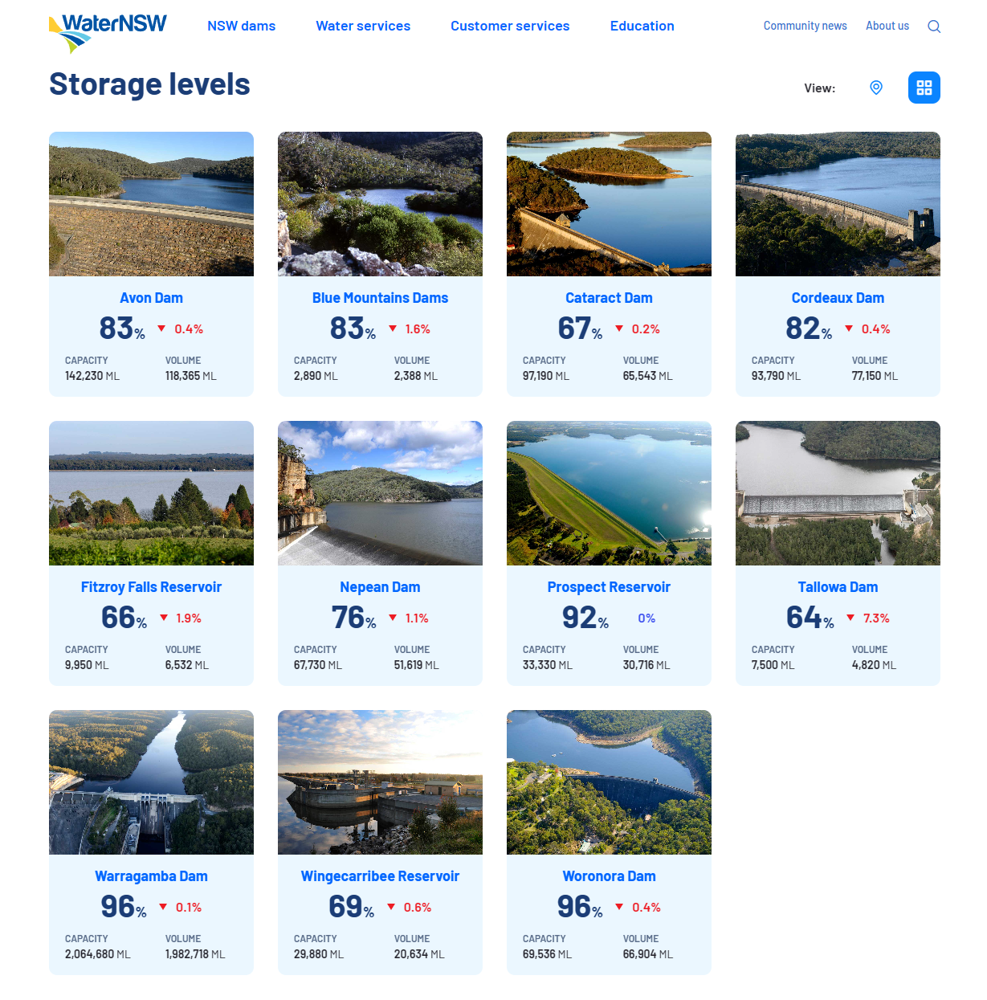

```{r setup, include=FALSE}
knitr::opts_chunk$set(echo = TRUE)
library(dplyr)
library(ggplot2)
library(lubridate)
library(tidyr)
library(stringr)
library(zoo)

```

```{r dataprep, include=FALSE}
#Global Variables
#Dataframe for the last week
start_date <- (date(Sys.Date())-8)
end_date <- date(Sys.Date())  # yesterdays's date

Last_week <- data.frame(seq(start_date, end_date, "days")) |>
            mutate(Collection_Date= seq.start_date..end_date...days..)

dams  <- c("Avon Dam",
                      "Blue Mountains Dams",
                      "Cataract Dam",
                      "Cordeaux Dam",
                      "Fitzroy Falls Reservoir",
                      "Nepean Dam",
                      "Prospect Reservoir",
                      "Tallowa Dam",
                      "Warragamba Dam",
                      "Wingecarribee Reservoir",
                      "Woronora Dam"

                      )

dams_capacity <- data.frame(
  `Dam Name` = dams,
  capacity = c(142230, 2890,97190,93790,9950,67730,33330,7500,2064680,29880,69536)
) |> arrange(desc(capacity)) |> rename(`Water Capacity (In Millions of litres)` = capacity)

#Graph Global variables
chart_col_count = 2


Custom_theme = theme(
   #legend.key.height = unit(0.5, "cm"),  # Change height
   #legend.key.width = unit(0.01, "cm"),    # Change width
   legend.position = "top"
  ) 

#For the forecast day zeros and spillover days a colour grading for each
#A
forecast_colour_grading <- c(
  "#3c9c00", "#749200", "#a08300", "#c66e00", "#e74e00", "#ff1235"
)

Forecast_levels    <-   c("Estimated_Day_zero_daily_depletion_rate", 
                    "Estimated_spillover_day_daily_capacity_rate",
                    "Estimated_Day_zero_weekly_depletion_rate", 
                    "Estimated_spillover_day_weekly_capacity_rate",
                    "Estimated_Day_zero_monthly_depletion_rate", 
                    "Estimated_spillover_day_monthly_capacity_rate",
                    "Estimated_Day_zero_60day_depletion_rate", 
                    "Estimated_spillover_day_60day_capacity_rate",
                    "Estimated_Day_zero_90day_depletion_rate", 
                    "Estimated_spillover_day_90day_capacity_rate",
                    "Estimated_Day_zero_120day_depletion_rate", 
                    "Estimated_spillover_day_120day_capacity_rate", 
                    "Historic Data")


#Data From scraped files
all_readings <- read.csv("Daily_Dam_Readings_Greater_Sydney.csv") |>                     
                mutate(Collection_Date = date(Collection_Date))


#Scraper performance over teh last week
disinct_readings_count <- all_readings |> 
                    group_by() |> count(Collection_Date) |>
                    mutate(`Complete reads` = (n / 14)*100) 


#Percentage of complete reads for the last week
last_week_performance <- Last_week |>
                       left_join(disinct_readings_count, by="Collection_Date") |> 
                       mutate(`Complete reads` = case_when(
                         is.na(`Complete reads`) ~ 0,
                         TRUE ~ `Complete reads`
                       ))

Percentage_Of_complete_daily_reads <- ggplot(last_week_performance, aes(Collection_Date, `Complete reads`))+
                            geom_line()+
                            ggtitle("Percentage of complete reads over the last week")


#Decay rate of dams by day by weekly average
all_readings_df <- all_readings |>
                  #Filter the data for the dams
                    mutate(data_classifier = case_when(
                      Variable %in% dams ~ "Dams",
                      TRUE ~ "Summaries"
                    )) |> 
  
                  #Filter for the dams dataset and remove the percentages
                    filter(data_classifier == "Dams") |>
                    mutate(daily_value = as.numeric(sub("%", "", daily_value))) |>
                    group_by(Variable) |> 
                #Calculate the rate of change by fixed time periods
                    mutate(daily__volume_change = as.numeric(daily_value) - as.numeric(lag(x= daily_value, n= 1)))|>    
                    mutate(Avg_Rolling_weekly_volume_change = (as.numeric(daily_value) - as.numeric(rollmean(daily_value, k=7)))/7) |>
                    mutate(Avg_Rolling_monthly_volume_change = (as.numeric(daily_value) - as.numeric(rollmean(daily_value, k=30)))/30) |> 
                    mutate(Avg_Rolling_60day_volume_change = (as.numeric(daily_value) - as.numeric(rollmean(daily_value, k=60)))/60) |> 
                    mutate(Avg_Rolling_90day_volume_change = (as.numeric(daily_value) - as.numeric(rollmean(daily_value, k=90)))/90) |> 
                    mutate(Avg_Rolling_120day_volume_change = (as.numeric(daily_value) - as.numeric(rollmean(daily_value, k=120)))/120) |> 
              #Depletion Rates
                  #Daily rate of change
                      mutate(Days_to_zero_at_daily_depletion_rate = case_when(
                        daily__volume_change >= 0 ~ NA,
                        daily__volume_change < 0 ~ days(round(abs((daily_value / daily__volume_change))))
                      )) |> 
                    #weekly depletion rate
                      mutate(Days_to_zero_at_weekly_depletion_rate = case_when(
                        Avg_Rolling_weekly_volume_change >= 0 ~ NA,
                        Avg_Rolling_weekly_volume_change < 0 ~  days(round(abs((daily_value / Avg_Rolling_weekly_volume_change))))
                      )) |> 
                    #Monthly depletion rate
                      mutate(Days_to_zero_at_monthly_depletion_rate = case_when(
                        Avg_Rolling_monthly_volume_change >= 0 ~ NA,
                        Avg_Rolling_monthly_volume_change < 0 ~  days(round(abs((daily_value / Avg_Rolling_monthly_volume_change))))
                      )) |>
                    #60 Day depletion rate
                      mutate(Days_to_zero_at_60day_depletion_rate = case_when(
                        Avg_Rolling_60day_volume_change >= 0 ~ NA,
                        Avg_Rolling_60day_volume_change < 0 ~  days(round(abs((daily_value / Avg_Rolling_60day_volume_change))))
                      ))|>
                    #90 Day depletion rate
                      mutate(Days_to_zero_at_90day_depletion_rate = case_when(
                        Avg_Rolling_90day_volume_change >= 0 ~ NA,
                        Avg_Rolling_90day_volume_change < 0 ~  days(round(abs((daily_value / Avg_Rolling_90day_volume_change))))
                      )) |>
                    #120 Day depletion rate
                      mutate(Days_to_zero_at_120day_depletion_rate = case_when(
                        Avg_Rolling_120day_volume_change >= 0 ~ NA,
                        Avg_Rolling_120day_volume_change < 0 ~  days(round(abs((daily_value / Avg_Rolling_120day_volume_change))))
                      )) |>
              #Capacity Rates 
                    #Daily rate of change
                      mutate(Days_to_full_at_daily_capacity_rate = case_when(
                        daily__volume_change > 0 ~ days(round(abs(((100-daily_value) / daily__volume_change)))),
                        daily__volume_change <= 0 ~ NA
                      )) |>
                    #weekly rate of change
                      mutate(Days_to_full_at_weekly_capacity_rate = case_when(
                        Avg_Rolling_weekly_volume_change > 0 ~ days(round(abs(((100-daily_value) / Avg_Rolling_weekly_volume_change)))),
                        Avg_Rolling_weekly_volume_change <= 0 ~ NA
                      )) |>
                    #Monthly rate of change
                      mutate(Days_to_full_at_monthly_capacity_rate = case_when(
                        Avg_Rolling_monthly_volume_change > 0 ~ days(round(abs(((100-daily_value) / Avg_Rolling_monthly_volume_change)))),
                        Avg_Rolling_monthly_volume_change <= 0 ~ NA
                      )) |>
                    #60 Day depletion rate
                      mutate(Days_to_full_at_60day_capacity_rate = case_when(
                        Avg_Rolling_60day_volume_change > 0 ~ days(round(abs(((100-daily_value) / Avg_Rolling_60day_volume_change)))),
                        Avg_Rolling_60day_volume_change <= 0 ~ NA
                      )) |>  
                    #90 Day depletion rate
                      mutate(Days_to_full_at_90day_capacity_rate = case_when(
                        Avg_Rolling_90day_volume_change > 0 ~ days(round(abs(((100-daily_value) / Avg_Rolling_90day_volume_change)))),
                        Avg_Rolling_90day_volume_change <= 0 ~ NA
                      )) |>  
                    #120 day depletion rate
                      mutate(Days_to_full_at_120day_capacity_rate = case_when(
                        Avg_Rolling_120day_volume_change > 0 ~ days(round(abs(((100-daily_value) / Avg_Rolling_120day_volume_change)))),
                        Avg_Rolling_120day_volume_change <= 0 ~ NA
                      )) |>
                  #For each of the 12 dates, what is the forecast date the dam will spill or deplete?
                      #For Depletion rates;
                        #daily Depletion rate:
                          mutate(Estimated_Day_zero_daily_depletion_rate = Days_to_zero_at_daily_depletion_rate + Collection_Date) |>
                          mutate(Estimated_Day_zero_weekly_depletion_rate = Days_to_zero_at_weekly_depletion_rate + Collection_Date) |>
                          mutate(Estimated_Day_zero_monthly_depletion_rate = Days_to_zero_at_monthly_depletion_rate + Collection_Date) |>
                          mutate(Estimated_Day_zero_60day_depletion_rate = Days_to_zero_at_60day_depletion_rate + Collection_Date) |>
                          mutate(Estimated_Day_zero_90day_depletion_rate = Days_to_zero_at_90day_depletion_rate + Collection_Date) |>
                          mutate(Estimated_Day_zero_120day_depletion_rate = Days_to_zero_at_120day_depletion_rate + Collection_Date) |>
                        #Daily capacity rates:
                          mutate(Estimated_spillover_day_daily_capacity_rate = Days_to_full_at_daily_capacity_rate + Collection_Date) |>
                          mutate(Estimated_spillover_day_weekly_capacity_rate = Days_to_full_at_weekly_capacity_rate + Collection_Date) |>
                          mutate(Estimated_spillover_day_monthly_capacity_rate = Days_to_full_at_monthly_capacity_rate + Collection_Date) |>
                          mutate(Estimated_spillover_day_60day_capacity_rate = Days_to_full_at_60day_capacity_rate + Collection_Date) |>
                          mutate(Estimated_spillover_day_90day_capacity_rate = Days_to_full_at_90day_capacity_rate + Collection_Date) |>  
                          mutate(Estimated_spillover_day_120day_capacity_rate = Days_to_full_at_120day_capacity_rate + Collection_Date) 

#Shorten the dataset to join to the chart
Historic_dataset<- all_readings_df |>
  filter(Collection_Date != date(Sys.Date())) |>
  mutate(`Forecast Type` = "Historic Data") |>
  mutate(`Date Type` = "Historic Data") |>
  rename(Date = Collection_Date) |> 
  mutate(Dam_level_range = "Historic Data") |>
  mutate(Dam_Level_Values = daily_value) |>
  select(Variable,`Forecast Type`, `Date Type`, Date, Dam_level_range, Dam_Level_Values)
                  
  #Subset series
  Yesterdays_Forecast <- all_readings_df |>
  select(Variable,Collection_Date, daily_value,
          Estimated_Day_zero_daily_depletion_rate, Estimated_spillover_day_daily_capacity_rate,
          Estimated_Day_zero_weekly_depletion_rate, Estimated_spillover_day_weekly_capacity_rate,
          Estimated_Day_zero_monthly_depletion_rate, Estimated_spillover_day_monthly_capacity_rate,
          Estimated_Day_zero_60day_depletion_rate, Estimated_spillover_day_60day_capacity_rate,
          Estimated_Day_zero_90day_depletion_rate, Estimated_spillover_day_90day_capacity_rate,
          Estimated_Day_zero_120day_depletion_rate, Estimated_spillover_day_120day_capacity_rate) |>
  filter(Collection_Date == end_date)|>
    pivot_longer(cols = starts_with("Estimated"),
                 names_to = "Forecast Type",
                 values_to = "Key Date"
                 ) |>
    mutate(Forecast_value = case_when(
      str_detect(`Forecast Type`, "Day_zero") ~ 0,
      str_detect(`Forecast Type`, "spillover_day") ~ 100,
      TRUE ~ 500
    ))
  
Yesterdays_Forecast_Graph_data <-Yesterdays_Forecast |>
  pivot_longer(
    cols = c("Collection_Date", "Key Date"),
    names_to = "Date Type",
    values_to = "Date"
  ) |>
  pivot_longer(
    cols = c("daily_value", "Forecast_value"),
    names_to  = "Dam_level_range",
    values_to = "Dam_Level_Values"
  ) |> filter(!is.na(Date)) |> 
  #The pivot longer matches the permutations - we want to remove them
    filter(`Date Type` != "Collection_Date" & Dam_level_range == "Forecast_value" |
           `Date Type` == "Collection_Date" & Dam_level_range == "daily_value" ) |>
    rbind(Historic_dataset) |>
  #Adding levels so that i can match the colours in the charts
  mutate(`Forecast Type` = factor(`Forecast Type`))# |>
#  mutate(`Forecast Type` = fct_recode(`Forecast Type`, Forecast_levels))

Yesterdays_day_zeros <- Yesterdays_Forecast_Graph_data |>
  filter(`Date Type` == "Key Date") |> select(Variable, `Forecast Type`, Date) |>
  pivot_wider(names_from = `Forecast Type`, values_from = Date) |>
  select(Variable, Estimated_Day_zero_daily_depletion_rate, Estimated_Day_zero_weekly_depletion_rate,
         Estimated_Day_zero_monthly_depletion_rate, Estimated_Day_zero_60day_depletion_rate,
         Estimated_Day_zero_90day_depletion_rate, Estimated_Day_zero_120day_depletion_rate)

yesterdays_spillover_days <- Yesterdays_Forecast_Graph_data |>
  filter(`Date Type` == "Key Date") |> select(Variable, `Forecast Type`, Date) |>
  pivot_wider(names_from = `Forecast Type`, values_from = Date) |>
  select(Variable, Estimated_spillover_day_daily_capacity_rate,
         Estimated_spillover_day_weekly_capacity_rate, Estimated_spillover_day_60day_capacity_rate,
         Estimated_spillover_day_90day_capacity_rate, Estimated_spillover_day_120day_capacity_rate)

  
#Plot series to show the forecasts by dam
  #2025 View
gg_dam_forecast_30 <-Yesterdays_Forecast_Graph_data |>
    ggplot(aes(x= Date, y = Dam_Level_Values , colour = `Forecast Type`),)+
    geom_line()+
    xlim(c(as.Date("2023-01-01"), as.Date("2030-01-01")))+
    ylim(0,100)+
    facet_wrap(~Variable, ncol = chart_col_count)+
    theme(legend.position = "none")+
    guides(colour=guide_legend(ncol=1))

gg_dam_forecast_60 <-Yesterdays_Forecast_Graph_data |>
    ggplot(aes(x= Date, y = Dam_Level_Values , colour = `Forecast Type`),)+
    geom_line()+
  xlim(c(as.Date("2023-01-01"), as.Date("2060-01-01")))+
    ylim(0,100)+
    facet_wrap(~Variable, ncol = chart_col_count)+
    Custom_theme+
    guides(colour=guide_legend(ncol=1))
  
```

This product is currently:

[](https://github.com/snazzyandy/Modelling-and-EDA/actions/workflows/greatersydscraper.yml)


## Why Scrape Greater Sydney Dam Levels?

A friend of mine mentioned that WaterNSW updated their website.
However, like with most web facelifts, the websites's functionality took a hit.
You used to be able to get all the daily historic data output as a csv, now you have these lovely pictures of the dams.

As a policy maker hes very interested in the daily releases of dam levels as a historic dataset.
Rather than him visiting the site each day and recording the data manually I wrote this basic script with github actions to scrape the site every day then kick it out as a csv.

The data we are borrowing is from [this page on Water NSW's site](https://www.waternsw.com.au/nsw-dams/nsw-storage-levels/greater-sydney-dam-levels)!


## Why Not use water insights?

[The WNSW app Water insights](https://waterinsights.waternsw.com.au/12964-sydney-drinking-water-catchment/#!) is a great product for most users but doesnt solve my daily data point query.
Instead it offers weekly, monthly and yearly data series.
For those looking for longitudinal data this is very useful!

## Where can i access the data?

All these daily data extracts are available in the data folder.
Open sourcing (MIT Licence) for those who are interested #OpenData!

## How has this product been performing

```{r graph}
## How has the scraper performed over the last week?

Percentage_Of_complete_daily_reads
```

## What are the key inferences we can derive from this data

Collecting daily data allows us to produce more granular rolling average estimates. These averages trend either upwards or downwards.

When dam levels trend towards 100% it means we are approaching 'Spillover Day'. 
Spillover day means that any additional water introduced to this dam will be redirected to either the floodgates or the spillway that connects to local rivers or communities.

Inversely, when dam levels are trending downwards 0% it means we are approaching "Day Zero". 
This means that the communities that are serviced by the dam are more likely to suffer drought restrictions and water utilities will have to treat more turbid water due to higher sediment levels at the bottom of these dams.
While it is highly unlikely that these dams will actually reach zero as government intervention requires the construction of desalination to intervene in the depletion rate this estimate speaks to how soon these events may happen based off the latest data.

Using the current storage level and the rolling averages sampled at 1,7,30,60,90 and 120 days can estimate the "Spillover" and "Day Zero" days using a range of rolling average estimates. 
Users worried about drought should focus on the 7 and 30 day forecasts as they imply the most recent rate of decay.
Users can also take solace knowing there is a degree of mean reversion when it comes to dams. Looking at the 90 and 120 day averages speak to a more conservative estimate.

As this scraper becomes more rich longer rolling averages may be introduced.


```{r Spillover dates}
#Based off yesterdays reading we estimate the following day zeros

knitr::kable(Yesterdays_day_zeros)

#Based off yesterdays reading we estimate the folling spill over days
knitr::kable(yesterdays_spillover_days)

```


```{r graph 2, fig.height=15}
# We can also visualize the spillover/day zero estimates using trend charts out to 2060 and 2030.
# As the lines converge, there is more mean reversion between the current depletion rate and the future rate
# As the lines diverge, it is more likely the recent data is an outlier to the historical average
# Note the most recent severe droughts had a 13% and 20% system depletion rate estimating the system runs out of water by 7.7 and 5 years respectively.

gg_dam_forecast_60
gg_dam_forecast_30

```

# Not all dams were created equal.

The graphic front loaded to this tool shows that capacities of each of these dams are different.
Policy makers therefore tend to hawk over Warragamba dam levels data points rather than the wider range as it dwarfs all other dams in this system.
An important side note is this 7500mL figure used for Tallowa dam refers to the amount Tallowa contributes to the wider system as part of the "Shoalhaven transfer scheme". 
Tallowa dam has an actual storage capacity of around 90,000ML

```{r Dam capacity table}

knitr::kable(dams_capacity)


```
