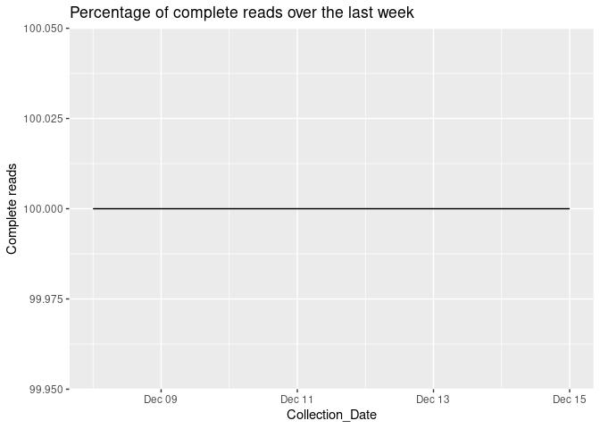

Welcome to the Greater Sydney Dam Levels Daily Data Scraper
-----------------------------------------------------------

This product is currently:

What Can we learn from the most recent readings
-----------------------------------------------

    ## How has the scraper performed over the last week?
    # Testing next to see if its deployed in the markdown on deploy

    Percentage_Of_complete_daily_reads

    #Based off the most recent estimates we can derive the following dates the dams will reach empty.
    knitr::kable(Yesterdays_day_zeros)

<table>
<colgroup>
<col style="width: 8%" />
<col style="width: 14%" />
<col style="width: 15%" />
<col style="width: 15%" />
<col style="width: 14%" />
<col style="width: 14%" />
<col style="width: 15%" />
</colgroup>
<thead>
<tr class="header">
<th style="text-align: left;">Variable</th>
<th style="text-align: left;">Estimated_Day_zero_daily_depletion_rate</th>
<th style="text-align: left;">Estimated_Day_zero_weekly_depletion_rate</th>
<th style="text-align: left;">Estimated_Day_zero_monthly_depletion_rate</th>
<th style="text-align: left;">Estimated_Day_zero_60day_depletion_rate</th>
<th style="text-align: left;">Estimated_Day_zero_90day_depletion_rate</th>
<th style="text-align: left;">Estimated_Day_zero_120day_depletion_rate</th>
</tr>
</thead>
<tbody>
<tr class="odd">
<td style="text-align: left;">Avon Dam</td>
<td style="text-align: left;">NA</td>
<td style="text-align: left;">2024-03-14</td>
<td style="text-align: left;">2025-06-30</td>
<td style="text-align: left;">2034-03-18</td>
<td style="text-align: left;">2031-08-24</td>
<td style="text-align: left;">2035-07-01</td>
</tr>
<tr class="even">
<td style="text-align: left;">Blue Mountains Dams</td>
<td style="text-align: left;">NA</td>
<td style="text-align: left;">NA</td>
<td style="text-align: left;">NA</td>
<td style="text-align: left;">NA</td>
<td style="text-align: left;">NA</td>
<td style="text-align: left;">NA</td>
</tr>
<tr class="odd">
<td style="text-align: left;">Cataract Dam</td>
<td style="text-align: left;">NA</td>
<td style="text-align: left;">NA</td>
<td style="text-align: left;">NA</td>
<td style="text-align: left;">NA</td>
<td style="text-align: left;">NA</td>
<td style="text-align: left;">NA</td>
</tr>
<tr class="even">
<td style="text-align: left;">Cordeaux Dam</td>
<td style="text-align: left;">NA</td>
<td style="text-align: left;">2024-01-09</td>
<td style="text-align: left;">2024-05-20</td>
<td style="text-align: left;">2026-10-04</td>
<td style="text-align: left;">2026-01-31</td>
<td style="text-align: left;">2026-12-05</td>
</tr>
<tr class="odd">
<td style="text-align: left;">Fitzroy Falls Reservoir</td>
<td style="text-align: left;">2024-01-16</td>
<td style="text-align: left;">2025-01-04</td>
<td style="text-align: left;">2024-06-15</td>
<td style="text-align: left;">2026-06-02</td>
<td style="text-align: left;">2026-05-07</td>
<td style="text-align: left;">2028-01-01</td>
</tr>
<tr class="even">
<td style="text-align: left;">Nepean Dam</td>
<td style="text-align: left;">NA</td>
<td style="text-align: left;">2024-05-23</td>
<td style="text-align: left;">2029-11-13</td>
<td style="text-align: left;">NA</td>
<td style="text-align: left;">2087-10-28</td>
<td style="text-align: left;">NA</td>
</tr>
<tr class="odd">
<td style="text-align: left;">Prospect Reservoir</td>
<td style="text-align: left;">NA</td>
<td style="text-align: left;">2024-05-17</td>
<td style="text-align: left;">2025-06-29</td>
<td style="text-align: left;">NA</td>
<td style="text-align: left;">2145-12-05</td>
<td style="text-align: left;">2044-11-08</td>
</tr>
<tr class="even">
<td style="text-align: left;">Tallowa Dam</td>
<td style="text-align: left;">NA</td>
<td style="text-align: left;">NA</td>
<td style="text-align: left;">NA</td>
<td style="text-align: left;">NA</td>
<td style="text-align: left;">NA</td>
<td style="text-align: left;">NA</td>
</tr>
<tr class="odd">
<td style="text-align: left;">Warragamba Dam</td>
<td style="text-align: left;">2024-03-15</td>
<td style="text-align: left;">2024-04-20</td>
<td style="text-align: left;">2025-12-09</td>
<td style="text-align: left;">2029-11-23</td>
<td style="text-align: left;">2031-03-10</td>
<td style="text-align: left;">2034-07-15</td>
</tr>
<tr class="even">
<td style="text-align: left;">Wingecarribee Reservoir</td>
<td style="text-align: left;">NA</td>
<td style="text-align: left;">2024-02-06</td>
<td style="text-align: left;">2024-09-26</td>
<td style="text-align: left;">2028-08-12</td>
<td style="text-align: left;">2027-09-14</td>
<td style="text-align: left;">2029-12-03</td>
</tr>
<tr class="odd">
<td style="text-align: left;">Woronora Dam</td>
<td style="text-align: left;">NA</td>
<td style="text-align: left;">2024-03-13</td>
<td style="text-align: left;">2025-05-18</td>
<td style="text-align: left;">2029-11-18</td>
<td style="text-align: left;">2030-01-31</td>
<td style="text-align: left;">2032-05-29</td>
</tr>
</tbody>
</table>

    #For those values that are NA, we expect the dam to spill over before they begin depleting again 
    knitr::kable(yesterdays_spillover_days)

<table>
<colgroup>
<col style="width: 9%" />
<col style="width: 17%" />
<col style="width: 18%" />
<col style="width: 17%" />
<col style="width: 17%" />
<col style="width: 18%" />
</colgroup>
<thead>
<tr class="header">
<th style="text-align: left;">Variable</th>
<th style="text-align: left;">Estimated_spillover_day_daily_capacity_rate</th>
<th style="text-align: left;">Estimated_spillover_day_weekly_capacity_rate</th>
<th style="text-align: left;">Estimated_spillover_day_60day_capacity_rate</th>
<th style="text-align: left;">Estimated_spillover_day_90day_capacity_rate</th>
<th style="text-align: left;">Estimated_spillover_day_120day_capacity_rate</th>
</tr>
</thead>
<tbody>
<tr class="odd">
<td style="text-align: left;">Avon Dam</td>
<td style="text-align: left;">NA</td>
<td style="text-align: left;">NA</td>
<td style="text-align: left;">NA</td>
<td style="text-align: left;">NA</td>
<td style="text-align: left;">NA</td>
</tr>
<tr class="even">
<td style="text-align: left;">Blue Mountains Dams</td>
<td style="text-align: left;">NA</td>
<td style="text-align: left;">2024-01-07</td>
<td style="text-align: left;">2028-07-21</td>
<td style="text-align: left;">2031-05-07</td>
<td style="text-align: left;">2028-09-17</td>
</tr>
<tr class="odd">
<td style="text-align: left;">Cataract Dam</td>
<td style="text-align: left;">NA</td>
<td style="text-align: left;">2024-07-26</td>
<td style="text-align: left;">2026-09-29</td>
<td style="text-align: left;">2028-07-03</td>
<td style="text-align: left;">2031-07-22</td>
</tr>
<tr class="even">
<td style="text-align: left;">Cordeaux Dam</td>
<td style="text-align: left;">NA</td>
<td style="text-align: left;">NA</td>
<td style="text-align: left;">NA</td>
<td style="text-align: left;">NA</td>
<td style="text-align: left;">NA</td>
</tr>
<tr class="odd">
<td style="text-align: left;">Fitzroy Falls Reservoir</td>
<td style="text-align: left;">NA</td>
<td style="text-align: left;">NA</td>
<td style="text-align: left;">NA</td>
<td style="text-align: left;">NA</td>
<td style="text-align: left;">NA</td>
</tr>
<tr class="even">
<td style="text-align: left;">Nepean Dam</td>
<td style="text-align: left;">NA</td>
<td style="text-align: left;">NA</td>
<td style="text-align: left;">2034-12-29</td>
<td style="text-align: left;">NA</td>
<td style="text-align: left;">2088-11-21</td>
</tr>
<tr class="odd">
<td style="text-align: left;">Prospect Reservoir</td>
<td style="text-align: left;">2023-12-27</td>
<td style="text-align: left;">NA</td>
<td style="text-align: left;">2025-01-14</td>
<td style="text-align: left;">NA</td>
<td style="text-align: left;">NA</td>
</tr>
<tr class="even">
<td style="text-align: left;">Tallowa Dam</td>
<td style="text-align: left;">NA</td>
<td style="text-align: left;">2023-12-15</td>
<td style="text-align: left;">2023-12-15</td>
<td style="text-align: left;">2023-12-15</td>
<td style="text-align: left;">2023-12-15</td>
</tr>
<tr class="odd">
<td style="text-align: left;">Warragamba Dam</td>
<td style="text-align: left;">NA</td>
<td style="text-align: left;">NA</td>
<td style="text-align: left;">NA</td>
<td style="text-align: left;">NA</td>
<td style="text-align: left;">NA</td>
</tr>
<tr class="even">
<td style="text-align: left;">Wingecarribee Reservoir</td>
<td style="text-align: left;">NA</td>
<td style="text-align: left;">NA</td>
<td style="text-align: left;">NA</td>
<td style="text-align: left;">NA</td>
<td style="text-align: left;">NA</td>
</tr>
<tr class="odd">
<td style="text-align: left;">Woronora Dam</td>
<td style="text-align: left;">NA</td>
<td style="text-align: left;">NA</td>
<td style="text-align: left;">NA</td>
<td style="text-align: left;">NA</td>
<td style="text-align: left;">NA</td>
</tr>
</tbody>
</table>

    #Based on a 120 day rolling average what date is warragamba likely to overflow or hit zero.
    gg_dam_forecast_60

    gg_dam_forecast_30

    ## Warning: Removed 2 rows containing missing values (`geom_line()`).

Why Scrape Greater Sydney Dam Levels?
-------------------------------------

A friend of mine mentioned that WaterNSW updated their website. However,
like with most web facelifts, the websites’s functionality took a hit.
You used to be able to get all the daily historic data output as a csv,
now you have these lovely pictures of the dams.

As a policy maker hes very interested in the daily releases of dam
levels as a historic dataset. Rather than him visiting the site each day
and recording the data manually I wrote this basic script with github
actions to scrape the site every day then kick it out as a csv.

The data we are borrowing is from [this page on Water NSW’s
site](https://www.waternsw.com.au/nsw-dams/nsw-storage-levels/greater-sydney-dam-levels)!

Why Not use water insights?
---------------------------

[The WNSW app Water
insights](https://waterinsights.waternsw.com.au/12964-sydney-drinking-water-catchment/#!)
is a great product for most users but doesnt solve my daily data point
query. Instead it offers weekly, monthly and yearly data series. For
those looking for longitudinal data this is very useful!

Where can i access the data?
----------------------------

All these daily data extracts are available in the data folder. Open
sourcing (MIT Licence) for those who are interested \#OpenData!
