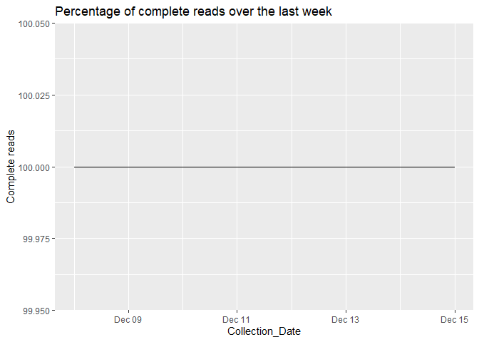

Todays Greater Sydney Dam Report
================
Last updated on 16 December, 2023

This product is currently:

[](https://github.com/snazzyandy/Modelling-and-EDA/actions/workflows/greatersydscraper.yml)

## Why Scrape Greater Sydney Dam Levels?

A friend of mine mentioned that WaterNSW updated their website. However,
like with most web facelifts, the websites’s functionality took a hit.
You used to be able to get all the daily historic data output as a csv,
now you have these lovely pictures of the dams.

As a policy maker hes very interested in the daily releases of dam
levels as a historic dataset. Rather than him visiting the site each day
and recording the data manually I wrote this basic script with github
actions to scrape the site every day then kick it out as a csv.

The data we are borrowing is from [this page on Water NSW’s
site](https://www.waternsw.com.au/nsw-dams/nsw-storage-levels/greater-sydney-dam-levels)\!


## Why Not use water insights?

[The WNSW app Water
insights](https://waterinsights.waternsw.com.au/12964-sydney-drinking-water-catchment/#!)
is a great product for most users but doesnt solve my daily data point
query. Instead it offers weekly, monthly and yearly data series. For
those looking for longitudinal data this is very useful\!

## Where can i access the data?

All these daily data extracts are available in the data folder. Open
sourcing (MIT Licence) for those who are interested \#OpenData\!

## How has this product been performing

``` r
## How has the scraper performed over the last week?
# Testing next to see if its deployed in the markdown on deploy


Percentage_Of_complete_daily_reads
```

<!-- --> \#\# What is the key
inference from this data

Collecting daily data allows us to produce more granular rolling average
estimates. These averages trend either upwards or downwards. When dam
levels trend towards 100% it means we are approaching ‘Spillover Day’.
Spillover day means that any addtional water introduced to this dam will
be redirected to either the floodgates or the spillway that connects to
local rivers or communities.

Inversely, when dam levels are trending downwards it means storage
capacity is reaching zero. This means that the communities that are
serviced by the dam are more likely to suffer drought restrictions and
water utilities will have to treat more turbid water due to higher
sediment levels at the bottom of these dams. It is highly unlikely that
these dams will actually reach zero as government intervention requires
the construction of desalination to artifically reduce this depletion
rate - a method that was highly effective in the 2016 and 2020 droughts
- however that is outside of the scope of this tool.

Using the current storage level and the rolling averages sampled at
1,7,30,60,90 and 120 days can estimate the “Spillover” and “Day Zero”
days based off the most recent data.

``` r
#Based off yesterdays reading we estimate the following day zeros

knitr::kable(Yesterdays_day_zeros)
```

| Variable                | Estimated\_Day\_zero\_daily\_depletion\_rate | Estimated\_Day\_zero\_weekly\_depletion\_rate | Estimated\_Day\_zero\_monthly\_depletion\_rate | Estimated\_Day\_zero\_60day\_depletion\_rate | Estimated\_Day\_zero\_90day\_depletion\_rate | Estimated\_Day\_zero\_120day\_depletion\_rate |
| :---------------------- | :------------------------------------------- | :-------------------------------------------- | :--------------------------------------------- | :------------------------------------------- | :------------------------------------------- | :-------------------------------------------- |
| Avon Dam                | NA                                           | 2024-03-14                                    | 2025-06-13                                     | 2033-06-10                                   | 2031-01-04                                   | 2033-06-21                                    |
| Blue Mountains Dams     | NA                                           | NA                                            | NA                                             | NA                                           | NA                                           | NA                                            |
| Cataract Dam            | NA                                           | NA                                            | NA                                             | NA                                           | NA                                           | NA                                            |
| Cordeaux Dam            | NA                                           | 2024-01-09                                    | 2024-05-15                                     | 2026-07-28                                   | 2025-11-26                                   | 2026-06-29                                    |
| Fitzroy Falls Reservoir | 2024-01-16                                   | 2024-08-08                                    | 2024-06-15                                     | 2026-04-16                                   | 2026-04-19                                   | 2027-12-10                                    |
| Nepean Dam              | NA                                           | 2024-05-10                                    | 2029-11-13                                     | NA                                           | 2061-02-01                                   | 2112-08-30                                    |
| Prospect Reservoir      | NA                                           | 2024-05-17                                    | 2025-06-29                                     | NA                                           | 2116-11-20                                   | 2043-07-22                                    |
| Tallowa Dam             | NA                                           | NA                                            | NA                                             | NA                                           | NA                                           | NA                                            |
| Warragamba Dam          | 2024-03-15                                   | 2024-04-20                                    | 2025-11-26                                     | 2029-09-28                                   | 2030-11-21                                   | 2033-06-12                                    |
| Wingecarribee Reservoir | NA                                           | 2024-02-06                                    | 2024-09-20                                     | 2028-03-20                                   | 2027-06-01                                   | 2028-12-07                                    |
| Woronora Dam            | NA                                           | 2024-03-13                                    | 2025-05-05                                     | 2029-09-22                                   | 2029-09-28                                   | 2031-07-14                                    |

``` r
#Based off yesterdays reading we estimate the folling spill over days
knitr::kable(yesterdays_spillover_days)
```

| Variable                | Estimated\_spillover\_day\_daily\_capacity\_rate | Estimated\_spillover\_day\_weekly\_capacity\_rate | Estimated\_spillover\_day\_60day\_capacity\_rate | Estimated\_spillover\_day\_90day\_capacity\_rate | Estimated\_spillover\_day\_120day\_capacity\_rate |
| :---------------------- | :----------------------------------------------- | :------------------------------------------------ | :----------------------------------------------- | :----------------------------------------------- | :------------------------------------------------ |
| Avon Dam                | NA                                               | NA                                                | NA                                               | NA                                               | NA                                                |
| Blue Mountains Dams     | NA                                               | 2024-01-10                                        | 2029-09-14                                       | 2030-04-16                                       | 2027-11-24                                        |
| Cataract Dam            | NA                                               | 2024-07-26                                        | 2026-08-26                                       | 2028-06-01                                       | 2031-03-16                                        |
| Cordeaux Dam            | NA                                               | NA                                                | NA                                               | NA                                               | NA                                                |
| Fitzroy Falls Reservoir | NA                                               | NA                                                | NA                                               | NA                                               | NA                                                |
| Nepean Dam              | NA                                               | NA                                                | 2040-03-09                                       | NA                                               | NA                                                |
| Prospect Reservoir      | 2023-12-27                                       | NA                                                | 2024-12-18                                       | NA                                               | NA                                                |
| Tallowa Dam             | NA                                               | 2023-12-15                                        | 2023-12-15                                       | 2023-12-15                                       | 2023-12-15                                        |
| Warragamba Dam          | NA                                               | NA                                                | NA                                               | NA                                               | NA                                                |
| Wingecarribee Reservoir | NA                                               | NA                                                | NA                                               | NA                                               | NA                                                |
| Woronora Dam            | NA                                               | NA                                                | NA                                               | NA                                               | NA                                                |

``` r
# We can also visualize the spillover/day zero estimates using trend charts out to 2060 and 2030.
# As the lines converge, there is more mean reversion between the current depletion rate and the future rate
# As the lines diverge, it is more likely the recent data is an outlier to the historical average
# Note the most recent severe droughts had a 13% and 20% system depletion rate estimating the system runs out of water by 7.7 and 5 years respectively.

gg_dam_forecast_60
```

<!-- -->

``` r
gg_dam_forecast_30
```

    ## Warning: Removed 1 row containing missing values (`geom_line()`).

<!-- -->
