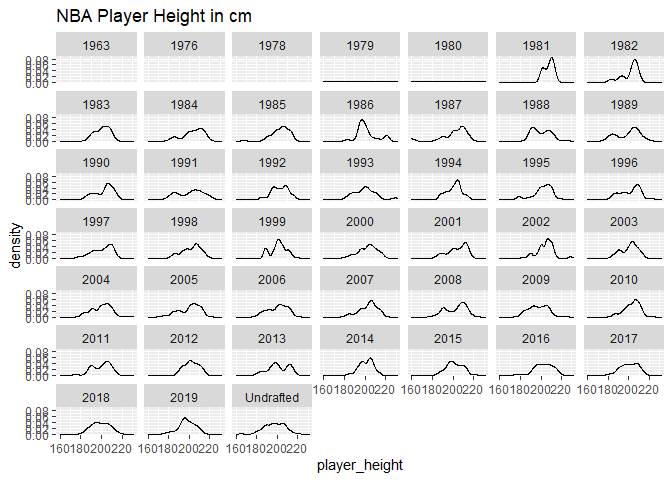

NBA Height analysis
================

## Purpose

Today my flatmate and I were watching the NBA and saw a huge dunk. I
told my flatmate i totally could do that if i was that height (Im 5’7)
and he said no way because my vertical height in jumps weren’t as high
as these guys.

I’m not remotely athletic however i thought it would be interesting to
look at the relationship between height and vertical jumps as these
larger athletes don’t need to jump as high a percentage of their overall
height to dunk.

In this doc im going to pull some height and vertical jumping stats as
well as compare them to the height of a standard nba ring to determine
the % of their overall height to deliver a dunk.

## Height data

Lets pull some basic height data to work from. Justinas Cirtautas did a
write up on kaggle last year on a similar topic, You can read his
analysis in the notebook here:
<https://www.kaggle.com/justinas/nba-height-and-weight-analysis/notebook>

He’s done a lot of heavy lifting here re: data scraping So lets thank
him and pull the base dataset from there. I was going to pull this data
using the kaggle API but ran into issues with authenticating the API
without putting my credentials into this script. Therefore I have
excluded that part and used the static data from:

<https://www.kaggle.com/justinas/nba-height-and-weight-analysis/data?select=all_seasons.csv>

extracted as at 2022/01/07 (YYY/MM/DD)

``` r
#Load libraries and Cirtuata's csv
library(knitr)
library(ggplot2)

Kaggle_data <- read.csv("all_seasons.csv", stringsAsFactors = FALSE)
```

So lets have a quick look at what we’ve got

``` r
head(Kaggle_data)
```

    ##   X       player_name team_abbreviation age player_height player_weight
    ## 1 0     Dennis Rodman               CHI  36        198.12      99.79024
    ## 2 1 Dwayne Schintzius               LAC  28        215.90     117.93392
    ## 3 2      Earl Cureton               TOR  39        205.74      95.25432
    ## 4 3       Ed O'Bannon               DAL  24        203.20     100.69742
    ## 5 4       Ed Pinckney               MIA  34        205.74     108.86208
    ## 6 5     Eddie Johnson               HOU  38        200.66      97.52228
    ##                       college country draft_year draft_round draft_number gp
    ## 1 Southeastern Oklahoma State     USA       1986           2           27 55
    ## 2                     Florida     USA       1990           1           24 15
    ## 3               Detroit Mercy     USA       1979           3           58  9
    ## 4                        UCLA     USA       1995           1            9 64
    ## 5                   Villanova     USA       1985           1           10 27
    ## 6                    Illinois     USA       1981           2           29 52
    ##   pts  reb ast net_rating oreb_pct dreb_pct usg_pct ts_pct ast_pct  season
    ## 1 5.7 16.1 3.1       16.1    0.186    0.323   0.100  0.479   0.113 1996-97
    ## 2 2.3  1.5 0.3       12.3    0.078    0.151   0.175  0.430   0.048 1996-97
    ## 3 0.8  1.0 0.4       -2.1    0.105    0.102   0.103  0.376   0.148 1996-97
    ## 4 3.7  2.3 0.6       -8.7    0.060    0.149   0.167  0.399   0.077 1996-97
    ## 5 2.4  2.4 0.2      -11.2    0.109    0.179   0.127  0.611   0.040 1996-97
    ## 6 8.2  2.7 1.0        4.1    0.034    0.126   0.220  0.541   0.102 1996-97

``` r
summary(Kaggle_data)
```

    ##        X         player_name        team_abbreviation       age       
    ##  Min.   :    0   Length:11145       Length:11145       Min.   :18.00  
    ##  1st Qu.: 2786   Class :character   Class :character   1st Qu.:24.00  
    ##  Median : 5572   Mode  :character   Mode  :character   Median :27.00  
    ##  Mean   : 5572                                         Mean   :27.17  
    ##  3rd Qu.: 8358                                         3rd Qu.:30.00  
    ##  Max.   :11144                                         Max.   :44.00  
    ##  player_height   player_weight      college            country         
    ##  Min.   :160.0   Min.   : 60.33   Length:11145       Length:11145      
    ##  1st Qu.:195.6   1st Qu.: 90.72   Class :character   Class :character  
    ##  Median :200.7   Median : 99.79   Mode  :character   Mode  :character  
    ##  Mean   :200.8   Mean   :100.64                                        
    ##  3rd Qu.:208.3   3rd Qu.:109.32                                        
    ##  Max.   :231.1   Max.   :163.29                                        
    ##   draft_year        draft_round        draft_number             gp       
    ##  Length:11145       Length:11145       Length:11145       Min.   : 1.00  
    ##  Class :character   Class :character   Class :character   1st Qu.:32.00  
    ##  Mode  :character   Mode  :character   Mode  :character   Median :58.00  
    ##                                                           Mean   :52.01  
    ##                                                           3rd Qu.:74.00  
    ##                                                           Max.   :85.00  
    ##       pts              reb             ast           net_rating      
    ##  Min.   : 0.000   Min.   : 0.00   Min.   : 0.000   Min.   :-200.000  
    ##  1st Qu.: 3.500   1st Qu.: 1.80   1st Qu.: 0.600   1st Qu.:  -6.300  
    ##  Median : 6.600   Median : 3.00   Median : 1.200   Median :  -1.300  
    ##  Mean   : 8.126   Mean   : 3.56   Mean   : 1.801   Mean   :  -2.154  
    ##  3rd Qu.:11.500   3rd Qu.: 4.70   3rd Qu.: 2.400   3rd Qu.:   3.200  
    ##  Max.   :36.100   Max.   :16.30   Max.   :11.700   Max.   : 300.000  
    ##     oreb_pct          dreb_pct         usg_pct           ts_pct      
    ##  Min.   :0.00000   Min.   :0.0000   Min.   :0.0000   Min.   :0.0000  
    ##  1st Qu.:0.02200   1st Qu.:0.0960   1st Qu.:0.1500   1st Qu.:0.4780  
    ##  Median :0.04300   Median :0.1320   Median :0.1820   Median :0.5210  
    ##  Mean   :0.05559   Mean   :0.1418   Mean   :0.1856   Mean   :0.5081  
    ##  3rd Qu.:0.08600   3rd Qu.:0.1820   3rd Qu.:0.2180   3rd Qu.:0.5570  
    ##  Max.   :1.00000   Max.   :1.0000   Max.   :1.0000   Max.   :1.5000  
    ##     ast_pct          season         
    ##  Min.   :0.0000   Length:11145      
    ##  1st Qu.:0.0650   Class :character  
    ##  Median :0.1020   Mode  :character  
    ##  Mean   :0.1311                     
    ##  3rd Qu.:0.1780                     
    ##  Max.   :1.0000

Im also interested in how the distribution of this data changes over
time, Likewise, does this mean that our model should include some kinda
of lag of exclusion of timeseries.

``` r
gg_height_density <- ggplot(Kaggle_data, aes(x=player_height))+
  geom_density()+
  ggtitle("NBA Player Height in cm")+
  facet_wrap(~draft_year)

gg_height_density
```

    ## Warning: Groups with fewer than two data points have been dropped.

    ## Warning: Groups with fewer than two data points have been dropped.

    ## Warning: Groups with fewer than two data points have been dropped.

    ## Warning in max(ids, na.rm = TRUE): no non-missing arguments to max; returning
    ## -Inf

    ## Warning in max(ids, na.rm = TRUE): no non-missing arguments to max; returning
    ## -Inf

    ## Warning in max(ids, na.rm = TRUE): no non-missing arguments to max; returning
    ## -Inf

<!-- -->
